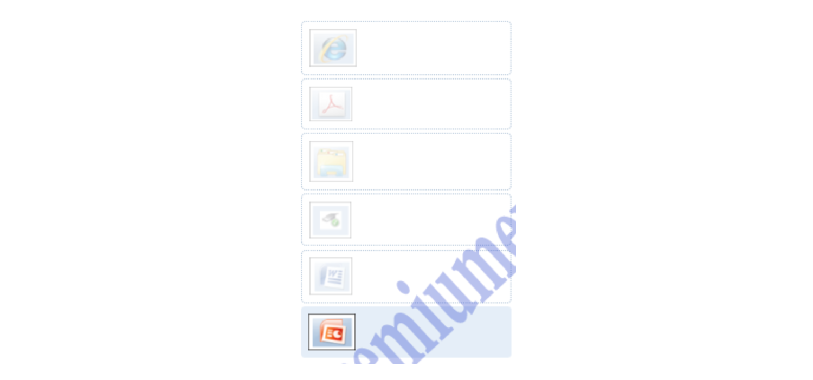
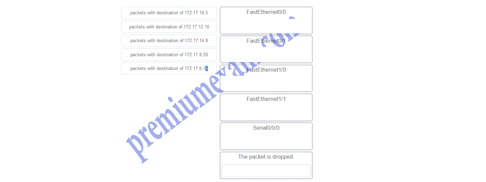

# CCNA Exercises 2018

1.  **Convert the decimal number 231 into its binary equivalent. Select the correct answer from the list below.**

    *   11110010 
    *   11011011 
    *   11110110 
    *   11100111 
    *   11100101 
    *   11101110

2.  **Convert the binary number 10111010 into its hexadecimal equivalent. Select the correct answer from the list below.**

    *   85
    *   90
    *   BA
    *   A1 
    *   B3 
    *   1C

3.  **The failure rate in a certain brand of network interface card has been determined to be 15%. How many cards could be expected to fail in a company that has 80 of the cards installed?**

    *   8 
    *   10 
    *   12 
    *   15

4.  **A local real estate company can have its 25 computer systems upgraded for CHF 1000. If the company chooses only to upgrade 10 systems, how much will the upgrade cost if the same rate is used?**

    *   CHF 100
    *   CHF 200
    *   CHF 400
    *   CHF 500
    *   CHF 600

5.  **Which two devices provide permanent data storage? (Choose two.)**

    *   Blu-Ray disc 
    *   hard drive 
    *   keyboard 
    *   monitor 
    *   RAM

6.  **If a technician uses an average of 2 cans of compressed air per week for cleaning, how many cans should be ordered for 8 technicians over the next 10 weeks?**

    *   16
    *   20
    *   80
    *   160
    *   200

7.  **What is a function of the BIOS?**

    *   enables a computer to connect to a network
    *   provides temporary data storage for the CPU
    *   performs a power-on self test of internal components
    *   provides graphic capabilities for games and applications

8.  **Which is a characteristic of the Internet?**

    *   It is not centrally governed.
    *   It uses only physical addresses.
    *   It uses private IP addressing.
    *   It is localized to specific geographic locations.

9.  **Which command can be used to test connectivity between two computers that are attached to a network?**

    *   ipconfig
    *   ping
    *   winipcfg 
    *   ifconfig 
    *   nbtstst -s

10.  **A person-hour is the amount of work that the average worker can do in one hour. It is anticipated that a company-wide system upgrade will take approximately 60 person-hours to complete. How long will it take five technicians to perform the refresh?**

     *   5 hours 
     *   8 hours 
     *   10 hours 
     *   12 hours

11.  **Considering the average capacity of storage device media, order the storage media from largest to smallest capacity.**

     *   Hard drive
     *   DVD
     *   CD
     *   Floppy disk

12.  **Refer to the exhibit. Match the port to the associated letter shown in the exhibit. (Not all options are used.)**
     

     *   DisplayPort
     *   DVI
     *   HDMI
     *   IEEE 1394
     *   PS/2
     *   S/PDIF
     *   USB

13.  **Refer to the exhibit. Match the port to the associated letter shown in the exhibit. (Not all options are used.)**
     

     *   Search for a file on disk
     *   Resume work on an open business letter
     *   Access a site on the World Wide Web
     *   Resume reading on open .pdf document
     *   Safely remove a flash drive

14.  **Match the form of network communication with its description. (Not all options are used.)**
     

     *   Interactive websites where people create and share user-generated content with friends and family
     *   Web pages that groups of people can edit and view together
     *   An audio-based medium that allows people to deliver their recordings to a wide audience
     *   Real-time communication between two or more people

15.  **Match the application with the correct compressed file format. (Not all options are used.)**
     

     *   HTML
     *   QuickTime
     *   GIF
     *   JPEG
     *   MPEG

16.  **A user is having problems accessing the Internet. The command ping www.cisco.com fails. However, pinging the IP address of cisco.com with the command ping 198.133.219.25 is successful. What is the problem?**

     *   The web server is down.
     *   The default gateway is incorrect
     *   There is a problem with DNS.

     *   The address of the ARP cache is incorrect.

17.  **Which option shows the proper notation for an IPv6 address?**

     *   2001,0db8,3c55,0015,abcd,ff13 
     *   2001-0db8-3c55-0015-abcd-ff13 
     *   2001.0db8.3c55.0015.abcd.ff13 
     *   2001:0db8:3c55:0015:​: abcd:​ff13

18.  **What is the purpose of the routing process?**

     *   to encapsulate data that is used to communicate across a network
     *   to select the paths that are used to direct traffic to destination networks
     *   to convert a URL name into an IP address 
     *   to provide secure Internet file transfer
     *   to forward traffic on the basis of MAC addresses

19.  **Which device should be used for enabling a host to communicate with another host on a different network?**

     *   switch 
     *   hub 
     *   router 
     *   host

20.  **A home user is looking for an ISP connection that provides high speed digital transmission over regular phone lines. What ISP connection type should be used?**

     *   DSL
     *   dial-up 
     *   satellite
     *   cell modem 
     *   cable modem

21.  **A company is expanding its business to other countries. All branch offices must remain connected to corporate headquarters at all times. Which network technology is required to support this requirement?**

     *   LAN 
     *   MAN 
     *   WAN 
     *   WLAN

22.  **Why would a network administrator use the tracert utility?**

     *   to determine the active TCP connections on a PC
     *   to check information about a DNS name in the DNS server
     *   to identify where a packet was lost or delayed on a network
     *   to display the IP address, default gateway, and DNS server address for a PC

23.  **Refer to the exhibit. Consider the IP address configuration shown from PC1. What is a description of the default gateway address?**
     

     *   It is the IP address of the Router1 interface that connects the company to the Internet.
     *   It is the IP address of the Router1 interface that connects the PC1 LAN to Router1.
     *   It is the IP address of Switch1 that connects PC1 to other devices on the same LAN.
     *   It is the IP address of the ISP network device located in the cloud.

24.  **Which subnet would include the address 192.168.1.96 as a usable host address?**

     *   192.168.1.64/26
     *   192.168.1.32/27 
     *   192.168.1.32/28 
     *   192.168.1.64/29

25.  **A technician uses the ping 127.0.0.1 command. What is the technician testing?**

     *   the TCP/IP stack on a network host
     *   connectivity between two adjacent Cisco devices
     *   connectivity between a PC and the default gateway
     *   connectivity between two PCs on the same network
     *   physical connectivity of a particular PC and the network

26.  **What is the purpose of ICMP messages?**

     *   to inform routers about network topology changes
     *   to ensure the delivery of an IP packet
     *   to provide feedback of IP packet transmissions
     *   to monitor the process of a domain name to IP address resolution

27.  **What is the general term that is used to describe a piece of data at any layer of a networking model?**

     *   frame
     *   packet
     *   protocol data unit 
     *   segment

28.  **How does a networked server manage requests from multiple clients for different services?**

     *   The server sends all requests through a default gateway.
     *   Each request is assigned source and destination port numbers.
     *   The server uses IP addresses to identify different services.
     *   Each request is tracked through the physical address of the client.

29.  **Which protocol translates a website name such as www.cisco.com into a network address?**

     *   HTTP 
     *   FTP 
     *   DHCP 
     *   DNS

30.  **A network technician is attempting to configure an interface by entering the following command: `SanJose(config)# ip address 192.168.2.1 255.255.255.0`. The command is rejected by the device. What is the reason for this?**

     *   The command is being entered from the wrong mode of operation.
     *   The command syntax is wrong.
     *   The subnet mask information is incorrect. 
     *   The interface is shutdown and must be enabled before the switch will accept the IP address.

31.  **What protocol is responsible for controlling the size of segments and the rate at which segments are exchanged between a web client and a web server?**

     *   TCP
     *   IP 
     *   HTTP 
     *   Ethernet

32.  **A network administrator is troubleshooting connectivity issues on a server. Using a tester, the administrator notices that the signals generated by the server NIC are distorted and not usable. In which layer of the OSI model is the error categorized?**

     *   presentation layer 
     *   network layer 
     *   physical layer 
     *   data link layer

33.  **Which statement is true about variable-length subnet masking?**

     *   Each subnet is the same size.
     *   The size of each subnet may be different, depending on requirements.
     *   Subnets may only be subnetted one additional time.
     *   Bits are returned, rather than borrowed, to create additional subnets

34.  **A wireless host needs to request an IP address. What protocol would be used to process the request?**

     *   FTP 
     *   HTTP 
     *   DHCP
     *   ICMP 
     *   SNMP

35.  **What will a host on an Ethernet network do if it receives a frame with a destination MAC address that does not match its own MAC address?**

   *   It will discard the frame.
   *   It will forward the frame to the next host. 
   *   It will remove the frame from the media. 
   *   It will strip off the data-link frame to check the destination IP address.

36.  **Which connection provides a secure CLI session with encryption to a Cisco switch?**

   *   a console connection 
   *   an AUX connection
   *   a Telnet connection 
   *   an SSH connection

37.  **What are the three ranges of IP addresses that are reserved for**
   **internal private use? (Choose three.)**

   *   10.0.0.0/8 
   *   64.100.0.0/14 
   *   127.16.0.0/12 
   *   172.16.0.0/12 
   *   192.31.7.0/24 
   *   192.168.0.0/16

 38.  **What statement describes the function of the Address Resolution Protocol?**

   *   ARP is used to discover the IP address of any host on a different network.
   *   ARP is used to discover the IP address of any host on the local network.
   *   ARP is used to discover the MAC address of any host on a different network.
   *   ARP is used to discover the MAC address of any host on the local network.

39.  **What is the purpose of having a converged network?**

   *   to provide high speed connectivity to all end devices
   *   to make sure that all types of data packets will be treated equally
   *   to achieve fault tolerance and high availability of data network infrastructure devices
   *   to reduce the cost of deploying and maintaining the communication infrastructure

40.  **Refer to the exhibit. Match the packets with their destination IP address to the exiting interfaces on the router. (Not all targets are used.)**

     
     

