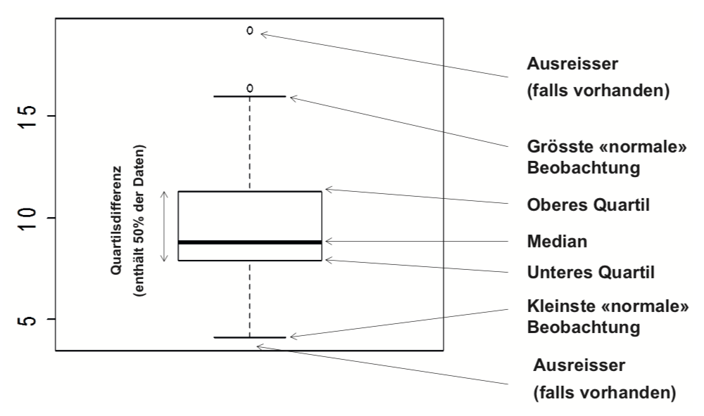
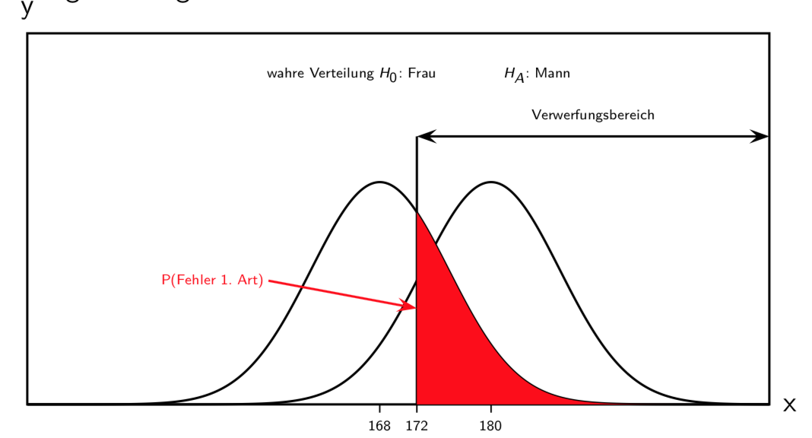
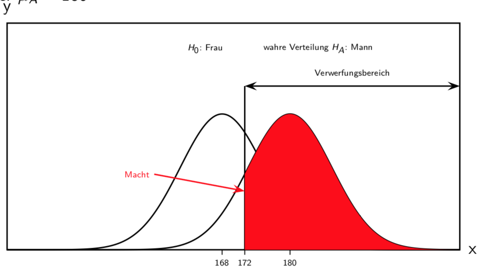

# Zusammenfassung STAT

## Nachkommastellen / Signifikaten Stellen

1. Das Ergebnis einer Addition/Subtraktion bekommt genauso viele Nachkommastellen wie die Zahl mit den wenigsten Nachkommastellen
2. Das Ergebnis einer Multiplikation/Division bekommt genauso viele signifikante Stellen wie die Zahl mit den wenigsten signifikanten Stellen

## Lageparameter

- Arithmetisches Mittel (Durchschnitt / Schwerpunkt der Daten $\bar{x}_n$) 
- Median
- Quantile

## Streuungsparameter

- Empirische Varianz / Standardabweichung
- Quartilsdifferenz
  $$\to$$ Differenz von $$25$$- und $$75$$-Quantil

## Arithmetisches Mittel (Lage)

- Durchschnitt / Mean / Schwerpunkt der Daten
- $$\overline{x}_n = \frac{x_1 + x_2 + … + x_n}{n} = \frac{1}{n} \sum^n_{i=1} x_i$$
- `data.mean()`

## Median (Lage)

* `data.median()`
* Berechnung (ohne Python):
  1. Datensatz der Grösse nach sortieren
  2. Der **Median** ist Wert der mittleren Beobachtung (Messung) 
     $$\to$$ aus 5 Beobachtungen ist Median also 3. Beobachtung
  3. Bei ungerader Anzahl Beobachtungen mittlere Beobachtung nehmen
  4. Bei gerader Anzahl Beobachtungen Durchschnitt der mittleren beiden Beobachtungen nehmen
  5. `sorted_data = data.sort_values(ascending=True)`
  6. `sorted_data[np.round(sorted_data.size/2 + 0.5) - 1]`
* Empirischer Median = $$50\%$$ - Quantil

---

$$\downarrow$$

## $\alpha$ - Quantil / Quartil (Lage)

* Quantil: Bereich in dem bestimmter `[Prozentsatz]` ($$\alpha$$) aller Beobachtung sind
* Quartil: Quantil, mit bestimmten Prozentsätzen (`25%` und `75%`)

* Unteres Quartil: `data.quantile(q=.25, interpolation="midpoint")` 
* Oberes Quartil: `data.quantile(q=.75, interpolation="midpoint")` 

$$\uparrow$$

---

## Empirische Varianz (Streuung)

* Verteilung der Daten um den Mittelwert
* Wenn empirische Varianz gross 
  $\to​$ Streuung um arithmetisches Mittel gross
* $$\displaystyle Var(x) = \frac{(x_1 - \overline{x})^2 + (x_2 - \overline{x})^2 + … + (x_n - \overline{x})^2}{n-1} = \frac{1}{n-1} \sum^n_{i=1} (x_i - \overline{x})^2$$

* $$\overline{x}$$ : arithmetisches Mittel
* Abweichungen $x_i − \bar{x}$ wird quadriert damit sich Abweichungen nicht gegenseitig aufheben können. Nenner $n - 1$ anstelle von $n$
* `data.var()`

## Empirische Standardabweichung (Streuung)

* Verteilung der Daten um Mittelwert in derselben Einheit wie Daten
* "mittlere" Abweichung vom Mittelwert
* $s_n = \sqrt{Var(x)} = 0.024\ cal/g$ 

## Quartilsdifferenz (Streuung)

* oberes Quartil - unteres Quartil
* Hälfte der "mittleren" Beobachtungen ($$50\%$$)
* Je kleiner, umso näher liegt Hälfte aller Werte um den Median

## Histogramm

* Werte graphisch darstellen
* `data.plot(kind="hist", bins=7, edgecolor="black")` 
* Bei weniger als 50 Messungen ca. 5 - 7 Klassen
* Bei mehr als 250 Messungen ca. 10 - 20 Klassen
* Klasse erhält Balken mit Höhe proportional zur Anzahl Beobachtungen in dieser Klasse
* Histogramm mit 20 Klassen von 0 - 100: 
  `data.plot(kind="hist", bins=np.arange(0, 100, 5), edgecolor="black")`

* **bimodal**: wenn zwei Peaks!

## Normiertes Histogramm

* Gesamtfläche der Balken $= 1$
* Auf Y-Achse sind die Dichten angegeben
* Balkenhöhe als $\frac{1}{n}$
* Vorteil: Messungen mit unterschiedlichen Umfängen besser miteinander vergleichbar
* `data.plot(kind="hist", normed=True, edgecolor="black")` 

## Boxplot

* grösste normale Beobachtung: $$1.5 \cdot \text{ Quartilsdifferenz }$$
* Ausreisser: Werte ausserhalb der normalen Beobachtungen
* Peaks nicht sichtbar im Boxplot
* Gut um Verteilung verschiedener Gruppen zu vergleichen
* rechtsschief: Boxplot unten (Histogramm Verteilung links)
* linksschief: Boxplot oben (Histogramm Verteilung rechts)
* sonst symmetrisch
* ersichtlich im Boxplot: Lage (Median), Streuung (Quartilsdifferenz), Schiefe
* `data.plot(kind="box", title="Boxplot")`

## Empirische Kummulative Verteilungsfunktion

* $$F_1(x) = \frac{1}{n} \text{ Anzahl }\{i | x_i \leq x\}$$
* Median bei 0.5
* Höhe des Sprungs zu berechnen: $$\frac{1}{n}$$ , $$n = $$ Anzahl Messungen an dieser Stelle
* `data.plot(kind="hist", normed=True, bins=7, cumulative=True)`

> siehe (..) für kummulative Verteilungsfunktion oder vielleicht nach unten bewegen

---

> 2Dimensionen $$\downarrow$$

## 2-Dimensionale Daten

* 2 Grössen werden gemessen (Weinkonsumation vs. Mortalität)
* Streudiagramm
* Lineare Regression

## Streudiagramm (2D)

* Untersuchung zweidimensionaler Daten (siehe oben)
* deutet auf Korrelation hin
* deutet nicht auf Kausalität hin
* `data.plot(kind="scatter", x="wine", y="mortality")`

## Lineare Regression (2D)

* Annahme: 
  * Abhängigkeit zweier Grössen ist linear
  * Daten im Streudiagram folgen *ungefahr* einer Geraden
* Gerade finden, die möglichst gut zu Daten passt (Regressionsgerade)

## Regressionsgerade

* Beobachtungspunkt: $$(x_i,y_i)$$
* entsprechende Punkt auf der Gerade: $$(x_i, a + bx_i)$$
* Residuum: $$r_i = y_i − (a+bx_i) = y_i − a − bx_i$$
  (Abweichung des Punkts von Gerade)
* Summe der quadrate der Residuen sollen minimal sein
  * Methode der kleinsten Quadrate
  * $$\sum^n_{i=1} r^2_i$$
* `b, a = np.polyfit(data["x"], data["y"], deg=1)`
* `x = np.linspace(data["x"].min() ,data["x"].max())`
* `plt.plot(x, a+bx, c="orange")`
* `a` : Achsenabschnitt der Regressionsgerade
* `b` : Steigung der Regressionsgerade
* `x` : x-Werte, um Start- und Endpunkt zu kennen
* Regressionsgerade sagt manchmal wenig über die wirkliche Verteilung der Punkte im Streudiagramm aus
* immer mit Streudiagramm ausgeben

## (Regressionsgerade Erweiterung)

* $$\displaystyle b = \frac{\sum^n_{i=1} (y_i - \overline{y})(x_i - \overline{x})}{\sum^n_{i=1} (x_i - \overline{x})^2}$$

* $$\displaystyle b = \overline{y} - b \overline{x}$$

* $$\overline{x}, \overline{y}$$ : Mittelwerte der jeweiligen Daten

  

## Empirische Korrelation

* $$\displaystyle r = \frac{\sum^n_{i=1} (x_i - \overline{x})(y_i - \overline{y})}{\sqrt{(\sum^n_{i=1}(x_i - \overline{x})^2) \cdot (\sum^n_{i=1} (y_i - \overline{y})^2)}}$$

* misst Stärke und Richtung der linearen Abhängigkeit zwischen den Daten $$x$$ und $$y$$

* $$-1$$ : fallende Korrelation *(je mehr, desto weniger)*
* $$\ \ \ 0$$ : keine Korrelation
* $$+1$$ : steigende Korrelation *(je mehr, desto mehr)*
* `data.corr()` , `data.corr().iloc[0,1]`
* nicht blind darauf verlassen! 

## Zufallsvariable

* Zufallsvariable $$X$$ ordnet jedem Zufallsexperiment *genau* eine Zahl zu
* $$X$$ somit eine Funktion
  * kann nur Werte in Wertemenge annehmen $$W_X =\{...\}$$
  * Wertemenge aus endlich viele Werte (also diskret)
* $$x$$ : eine konkreter Wert (eine Realisierung) von $$X$$
* $$X$$ : eine Menge (eine Funktion)

## Diskrete vs. Kontinuierliche Datenmenge

* Diskrete Datenmenge
  * endliche Menge an Werten ("Messungen")
  * löchrig
* Kontinuierliche Datenmenge
  * kontinuierlich, stetig
  * z.B. Funktion

## Wahrscheinlichkeitsdichte

* Ableitung der kummulativen Verteilungsfunktion
* $$f(x) = F′(x)$$

## Kummulative Verteilungsfunktion

* $$F(x) = P(X ≤ x)$$

* $$\displaystyle P(a < X ≤ b) = F(b) − F(a) = \int^b_a f(x)\ dx​$$
* $$0 \leq F(x) \leq 1$$
* $$\displaystyle F(x) = \int^x_{-\infin} f(s)\ ds, \quad F(-\infin) = 0$$
* $$\displaystyle F(b) = \int^b_{a} f(s)\ ds = 1$$
* Median finden: $$F(x) = 0.5$$
* Wahrscheinlichkeiten (für stetige Wahrscheinlichkeitsverteilungen) entsprechen Flächen unter der Dichtefunktion
* Input : Zahl (Messwert)
* Output: Wahrscheinlichkeit (kleiner oder gleich diese Zahl)

## Erwartungswert (diskrete Zufallsvariablen)

* $$\displaystyle E[X] = \sum_{i} x_i \cdot P(X = x_i)$$
* Summe aller betreffenden Zahlen mal die Wahrscheinlichkeit bestimmter Zahl

## Erwartungswert (stetige Verteilung)

* $$\displaystyle E[X] = \mu_X = \int^\infin_{-\infin} x f(x)\ dx​$$
* falls $$[a, b]$$ gegeben $$\displaystyle \int^b_{a} x f(x)\ dx$$

## Varianz / Standardabweichung (stetige Verteilung)

* $$\displaystyle Var[X] = \sigma^2_X = E[(X - E[X])^2] = \int^\infin_{-\infin} (X - E[X])^2 f(x)\ dx = E[X^2] - E[X]^2​$$

## Quantile (stetige Verteilung)

* $$\displaystyle F(q(\alpha))=\alpha⇔q(\alpha)=F^{−1}(\alpha)$$
* Quantile sind die Umkehrung der kumulativen Verteilungsfunktion
* Input: Wahrscheinlichkeit
* Output: Zahl, die mit dieser Wahrscheinlichkeit zutrifft

## Wichtige diskrete Verteilungen

* Binomialverteilung
* Poisson-Verteilung

## Wichtige stetige Verteilungen

* Uniforme Verteilung
* Exponentialverteilung
* Normalverteilung (Gauss)
* Standardnormalverteilung

## Uniforme Verteilung

> stetige Verteilung

* Jeder Wert im Intervall $$[a,b]$$ ist gleichwahrscheinlich
* $$X \sim \text{Uniform}([a, b])​$$
* Dichte ist also konstant 
* $$\displaystyle f(x) = \begin{cases} \frac{1}{b-a} \quad \text{a} \leq x \leq b \\ 0 \quad \quad \text{sonst} \end{cases}​$$
* $$F(x) =  \begin{cases} 0 \quad \quad \text{falls } x < a \\ \frac{x - a}{b-a} \quad \text{a} \leq x \leq b \\ 0 \quad \quad \text{falls } x > b \end{cases}​$$
* $$E[X] = \frac{b + a}{2}​$$
* $$Var[X] = \frac{(b-a)^2}{12}$$
* $$\sigma_X = \frac{b - a}{\sqrt{12}}$$
* Wahrscheinlichkeitsdichte, von $$5$$ auf dem Intervall $$[a,b]$$
  * `st.uniform.pdf(x=5, loc=a, scale=b-1)`
* Wahrscheinlichkeit, von $$5$$ auf dem Intervall $$[a, b]$$
  * `st.uniform.cdf(x=5, loc=a, scale=b-1)`
* Uniform verteilte Zufallsvariablen generieren
  * `st.uniform.rvs(loc=a, scale=b-a, size=anzahl)`

## Exponentialverteilung

> stetige Verteilung

* einfachste Modell für
  * Wartezeiten auf Ausfälle, 
  * also für die Lebensdauer
* $$X \sim \text{Exp}(\lambda)​$$
* $$\displaystyle f(x) = \begin{cases} \lambda \cdot \text{exp}(-\lambda x), \quad \text{falls } x \geq 0 \\ 0 \quad \quad \quad \quad \quad \quad \quad \text{sonst} \end{cases}​$$
* $$ \displaystyle F(x) = \begin{cases} 1 - e^{-\lambda x}, \quad \text{falls } x \geq 0 \\ 0 \quad \quad \quad \quad \quad \text{falls } x < 0 \end{cases}​$$
* $$E[X] = \frac{1}{\lambda}​$$
* $$Var[X] = \frac{1}{\lambda^2}$$
* $$\sigma_X = \frac{1}{\lambda}​$$
* $$X \sim \text{Exp}(3) = P(X \leq 4)$$ : 
  `st.expon.cdf(x=4, scale=1/3)` 
* Zusammenhang Poisson-Verteilung und Exponentialverteilung: Wenn die Zeiten zwischen den Ausfällen eines Systems exponential($$\lambda$$)-verteilt sind, dann ist die Anzahl Ausfälle in einem Intervall der Länge $$t$$ Poisson($$\lambda t$$)- verteilt. 

## Zusammenhang Poisson-Verteilung und Exponentialverteilung

* Wenn die *Zeiten* zwischen den Ausfällen eines Systems exponential($$\lambda$$)-verteilt
  sind, dann ist die *Anzahl* Ausfälle in einem Intervall der Länge $$t$$ Poisson($$\lambda t$$)-
  verteilt.
* $$P(T > t) = P(\text{kein Zerfall in [0, t])} = \frac{(\lambda t)^0 e^{-\lambda t}}{0!} = e^{-\lambda t} = 1 - P(T \leq t)​$$

## Normalverteilung

* häufigste Verteilung für Messwerte
* symmetrisch um den Erwartungswert $$\mu$$
* $$\displaystyle f(x) = \frac{1}{\sigma \sqrt{2 \pi}} \exp \left(- \frac{(x - \mu)^2}{2 \sigma^2} \right)​$$
* $$X \sim N(\mu, \sigma^2)​$$
* $$\displaystyle E[X] = \mu_X = \int^\infin_{-\infin} x f(x)\ dx$$
* $$E[X]​$$, falls $$[a, b]​$$ gegeben $$\displaystyle \int^b_{a} x f(x)\ dx​$$
* $$\displaystyle Var[X] = \sigma^2_X = E[(X - E[X])^2] = \int^\infin_{-\infin} (X - E[X])^2 f(x)\ dx = E[X^2] - E[X]^2$$
* $$P(X \leq 130)$$ für $$X \sim N(100, 15^2)$$: 
  `st.norm.cdf(x=130, loc=100, scale=15)`
* Grenzwerte von $$q_{0.025}​$$ bis $$q_{0.975}​$$ :
  `st.norm.ppf(q=[0.025, 0.975], loc=100, scale=15)`
  $$95\%​$$ der Werte sind zwischen $$70.6​$$ und $$129.4​$$ 

* $$P(\mu − \sigma ≤ X ≤ \mu + \sigma)​$$ : Wahrscheinlichkeit, dass Beobachtung höchsten eine Standardabweichung vom Erwartungswert abweicht

## Standardnormalverteilung

* Normalverteilung mit $$\mu = 0$$ und $$\sigma^2 = 1$$
* um $$0$$ symmetrisch
* $$\displaystyle f(x) = \varphi(x) = \frac{1}{\sqrt{2 \pi}} \exp \left( - \frac{x^2}{2} \right)​$$
* $$\displaystyle F(x) = \Phi(x) = \int^x_{-\infin} \varphi(y)\ dy​$$
* $$Z \sim N(0, 1)$$
* $$P(Z \leq 1.13) :$$ `st.norm.cdf(x=1.13)`
* Für welchen Wert von $$z$$ ist $$\Phi (z) = 0.7910$$ ?
  `st.norm.ppf(q=0.7910)`

## Standardisieren einer normalverteilten Zufallsvariable

- $$\displaystyle Z = \frac{X - \mu}{\sigma} \sim N(0, 1)$$

## Lineare Transformationen (Zufallsvariablen)

* $$E[Y] = E[a + bX] = a + bE[X]$$
* $$Var[Y] = Var[a + bX] = b^2Var[X]$$
* $$\sigma_Y = |b| \sigma_X$$
* $$q_Y(\alpha) = a + bq_X(\alpha)$$
* Standardisierung:
  * $$\displaystyle f_Y(y) = \frac{1}{b} f_X \left( \frac{y-a}{b} \right)$$

## Kennzahlen von $S_n$ und  $\overline{X}_n$

* unabhängige Zufallsvariablen
* Bei Wiederholung von gleichen Messungen und Kennzahlen nicht vorgegeben
  * gleiche Grösse mehrmals messen
    - mehrere Individuen oder
    - Messungen wiederholen
* nur wenn i.i.d. (independent, identically distributed),
  * und Kennzahlen nicht schon vorgegeben
* wenn viele Beobachtungen $$\to$$ immer genauer!
* für grosse $$n$$ ist arithmetisches Mittel $$\overline{X}_n$$ sehr nahe an $$E[\overline{X}_n]$$
  (Gesetz der grossen Zahlen)
* Kennzahlen $$S_n​$$ (Augensumme)
  * $$\displaystyle S_n = X_1 + … + X_n = \sum^n_{i=1} X_i$$
  * $$E[S_n] = n\mu$$
  * $$Var[S_n] = n\ Var[X]$$
    Je grösser $$n$$, desto grösser Streuung der Augensumme
  * $$\sigma[S_n] = \sqrt{n} \sigma_x$$
* Kennzahlen $$\overline{X}_n$$ (mittlere Augenzahl)
  * $$\displaystyle \overline{X}_n = \frac{1}{n} (X_1 + X_2 + … + X_n) = \frac{1}{n} \sum^n_{i=1} X_i = \frac{1}{n} S_n$$
  * $$E[\overline{X}_n] = \mu​$$
  * $$Var[\overline{X}_n] = \frac{\sigma^2_X}{n}$$
  * oder auch: $$Var[\overline{X}_n] = \frac{1}{n} (Var[X])$$
    (dann ganz old-school Varianz ausrechnen durch $$n$$)
  * Je grösser $$n​$$, desto kleiner Streuung der Augenzahl
  * $$\sigma[\overline{X}_n] = \frac{\sigma_X}{\sqrt{n}}​$$ (Standard-Fehler)
* Gesetze
  * $$E[X_1 + X_2] = E[X_1] + E[X_2]​$$
  * $$Var[X_1 + X_2] = Var[X_1] + Var[X_2]$$

## Zentraler Grenzwertsatz $S_n$ und $\overline{X}_n$

* $$S_n \sim \mathcal{N}(n\mu,n\sigma^2_X )​$$
* $$\overline{X}_n \sim \mathcal{N}(\mu, \frac{\sigma^2_X}{n})$$
* Binomialverteilung $$\approx$$ Normalverteilung für $$n$$ gross
* Poissonverteilung $$\approx$$ Normalverteilung für $$\lambda$$ gross

## Kennzahlen Binomialverteilung

* $$X \sim \text{Bin}(n, \pi)$$
  * $$\pi$$ ist eine Variable (nicht Wert $$\pi$$)
* $$\mu = E[X] = n\pi$$
* $$\sigma^2 = Var[X] = n \pi (1-\pi)​$$
* Als Approximation Normalverteilung $$\mathcal{N}(\mu, \sigma^2)$$ nehmen
* $$\displaystyle P[X \leq x] \approx \Phi \left( \frac{x - n\pi}{\sqrt{n\pi(1-\pi)}} \right)$$

## Kennzahlen Poissonverteilung

* $$X \sim \text{Pois}(\lambda)​$$
* $$\mu = E[X] = \lambda​$$
* $$\sigma^2 = Var[X] = \lambda$$
* Als Approximation Normalverteilung $$\mathcal{N}(\mu, \sigma^2)$$ nehmen
* $$\displaystyle P[X \leq x] \approx \Phi \left( \frac{x - \lambda}{\sqrt{\lambda}} \right)$$

## Standardfehler

* $$\displaystyle s_{\overline{x}_n} = \frac{s_x}{\sqrt{n}}​$$ 
* $$\displaystyle \overline{x}_n \pm s_{\overline{x}_n}​$$ (absolute Fehler)
* $$\displaystyle \overline{x}_n \pm \frac{s_{\overline{x}_n}}{\overline{x}_n} \cdot 100\% $$  (relativer Fehler)

## QQ-Plot (Normalplot / Probplot)

- überprüfen, ob normalverteilt
- miteinander vergleichen
  - theoretische Quantile $$\Phi^{-1}(\alpha_k)$$ [$$-1.9600$$ bis $$1.9600$$]
  - empirische Quantile (aus Datensatz)
- `st.probplot(x, plot=plt)`

## Fehler 1. Art

- Entscheidung für $$H_A$$ aber $$H_0$$ richtig
- Entspricht dem Signifikanzniveau
- kontrolliert durch möglichst kleines Signifikanzniveau

## Macht

- $$H_A$$ angenommen und $$H_A$$ richtig
- wahre Parameter für $$H_A$$ muss zur Berechnung der W'keit bekannt sein

## Fehler 2. Art

- Entscheidung für $$H_0$$ aber $$H_A$$ richtig
- wahre Parameter für $$H_A$$ muss zur Berechnung der W'keit bekannt sein
- $$1 - \text{Macht}$$
- keine Kontrolle wie bei Fehler 1. Art
- Fehler 1. Art grösser, dann Fehler 2. Art kleiner

## Vertrauensintervall für $\mu$

* $$K = (-\infin, t_{n-1; \frac{\alpha}{2}}]\cup [t_{n-1; 1-\frac{\alpha}{2}}, \infin)$$
* SW05, 11/13
* SW05, 12/13
* SW05, 13/13

## P-Wert

* P-Wert ist ein Wert zwischen 0 und 1, der angibt, wie gut eine sogenannte Nullhypothese (z.B. hier die Behauptung des Sportamtes) und Daten zusammenpassen (0: passt gar nicht; 1: passt sehr gut)
* die W’keit, unter Annahme der Nullhypothese das erhaltene Ergebnis oder ein extremeres zu erhalten
* Je kleiner der P-Wert, desto mehr spricht das Ergebnis gegen die Nullhypothese

## z-Test vs t-Test

* $$\sigma_x$$ ist bekannt $$\to$$ z-Test
* $$\sigma_x$$ wurde geschätzt $$\to$$ t-Test

## z-Test

* wir setzen unseren geschätzten Mittelwert ein unter der Annahme, dass `loc=nullhypothese`  der Mittelwert ihrer Nullhypothese stimmt
* SW06, 9/17

## t-Test

* gleich wie bei z-Test einfach mit geschätztem $$\hat{\sigma}$$ 
* 

## DataFrame

* Alle enthaltenen Arrays müssen dieselbe Länge besitzen